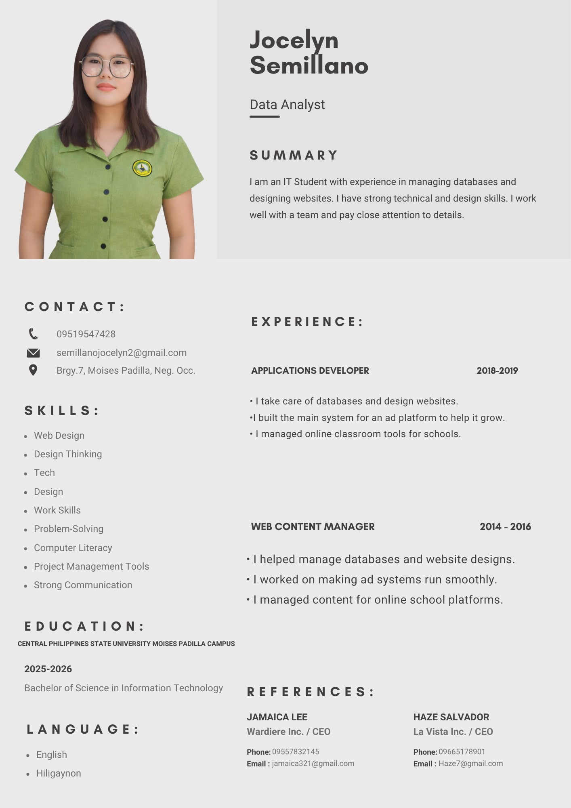

<html lang="en">
<head>
<meta charset="UTF-8" />
<meta name="viewport" content="width=device-width, initial-scale=1.0" />
<title>Jocelyn Semillano - Enchanted Portfolio</title>
<link href="https://fonts.googleapis.com/css2?family=Poppins:wght@300;400;600;700;800&display=swap" rel="stylesheet">

</head>

<body>

  

<nav class="py-4 px-2 text-center text-white font-bold text-xs sm:text-base flex flex-wrap justify-center gap-4 sticky top-0 z-50 bg-pink-700/40 backdrop-blur-lg border-b border-pink-500/30">
  <a href="#home" class="hover:text-pink-300 transition">Home</a>
  <a href="#about" class="hover:text-pink-300 transition">About</a>
  <a href="#resume" class="hover:text-pink-300 transition">Resume</a>
  <a href="#certificates" class="hover:text-pink-300 transition">Certificates</a>
  <a href="#simulation" class="hover:text-pink-300 transition">Simulation</a>
  <a href="#skills" class="hover:text-pink-300 transition">Skills</a>
  <a href="#experience" class="hover:text-pink-300 transition">Experience</a>
  <a href="#tutorials" class="hover:text-pink-300 transition">Tutorials</a>
  <a href="#contact" class="hover:text-pink-300 transition">Contact</a>
</nav>

<section id="home" class="flex flex-col items-center text-center px-4 py-20">
  <h1 class="text-4xl sm:text-5xl font-bold mb-8 glow-text">Welcome to My Portfolio!</h1>
  

    
  

</section>

<section id="about" class="text-center px-4 py-16 bg-black/20">
  <h2 class="text-3xl font-bold mb-6 text-pink-400 glow-text">✨ About Me ✨</h2>
  

    
I am Celyn (Jocelyn Semillano), a passionate 2nd Year BSIT Student. I specialize in weaving together code and design to create magical digital experiences.

  

</section>

<section id="resume" class="text-center px-4 py-16">
  <h2 class="text-3xl font-bold mb-8 text-pink-400 glow-text">📄 My Resume</h2>
  

    

      
      

        <a href="resume.jpg" target="_blank" class="py-2 px-6 bg-purple-600 text-white font-bold rounded-lg hover:bg-purple-700 transition text-sm">View Full Document</a>
        <a href="resume.jpg" download class="py-2 px-6 bg-pink-600 text-white font-bold rounded-lg hover:bg-pink-700 transition text-sm">Download (.JPG)</a>
      

    

  

</section>

<section id="certificates" class="text-center px-4 py-16">
  <h2 class="text-3xl font-bold mb-10 text-pink-400 glow-text">📜 IT Training Certificates</h2>
  

    

      
March 10, 2026

      
      <a href="March 10.jpg" download class="text-xs bg-pink-600 py-1 px-3 rounded hover:bg-pink-700 transition">Download Copy</a>
    

    

      
March 12, 2026

      
      <a href="March 12.jpg" download class="text-xs bg-pink-600 py-1 px-3 rounded hover:bg-pink-700 transition">Download Copy</a>
    

  

</section>

<section id="simulation" class="text-center px-4 py-16">
  <h2 class="text-3xl font-bold mb-10 text-pink-300 glow-text">🧪 My Simulation</h2>
  

    <h3 class="text-2xl font-bold mb-6 text-white">BSIT-2B Attendance System</h3>
    
    

      

        <label class="text-xs text-pink-300 block mb-1 ml-1">Select Date</label>
        <input type="date" id="attendanceDate" class="bg-black/60 border border-pink-500 text-white p-2 rounded-lg outline-none">
      

      

        <label class="text-xs text-pink-300 block mb-1 ml-1">Subject</label>
        <input type="text" id="subjectName" placeholder="e.g. Web Dev" class="bg-black/60 border border-pink-500 text-white p-2 rounded-lg outline-none w-48">
      

    

    

      

        <h4 class="text-pink-300 font-bold mb-4 flex justify-between items-center">Girls 🌸 Total: 15</h4>
        

      

      

        <h4 class="text-blue-300 font-bold mb-4 flex justify-between items-center">Boys 💎 Total: 14</h4>
        

      

    

    <button onclick="generateSummary()" class="px-20 py-4 bg-pink-600 rounded-full font-bold hover:bg-pink-700 transition transform hover:scale-105 shadow-xl border-2 border-pink-400">DONE ✨</button>

    

      <h3 class="text-2xl font-bold text-center text-pink-400 mb-4">Attendance Report</h3>
      

      

        

          <h4 class="text-green-400 font-bold text-lg mb-3">Present: 0</h4>
          

        

        

          <h4 class="text-red-400 font-bold text-lg mb-3">Absent: 0</h4>
          

        

      

    

  

</section>

<section id="skills" class="text-center px-4 py-16">
  <h2 class="text-3xl font-bold mb-10 text-pink-400 glow-text">🛠️ My Skills & Designs</h2>
  

    
    
    
    
  

</section>

<section id="experience" class="text-center px-4 py-16">
  <h2 class="text-3xl font-bold mb-8 text-pink-400 glow-text">🏆 Achievements</h2>
  

    <h3 class="text-2xl font-bold text-pink-300 mb-2">Video Editing Champion (2021)</h3>
    
PNP Anniversary Video Editing Contest

    

      
      
    

  

</section>

<section id="tutorials" class="text-center px-4 py-16">
  <h2 class="text-3xl font-bold mb-10 text-pink-300 glow-text">✨ Tutorials</h2>
  

    <iframe class="rounded-2xl w-full h-72 glow-border" src="https://www.youtube.com/embed/wCEtWz5imUs"></iframe>
    <iframe class="rounded-2xl w-full h-72 glow-border" src="https://www.youtube.com/embed/ezldKx-jPag"></iframe>
  

</section>

<section id="contact" class="text-center px-4 py-16 bg-black/30">
  <h2 class="text-3xl font-bold mb-8 text-pink-400 glow-text">💌 Let's Connect</h2>
  

    <form class="space-y-4">
      <input type="text" placeholder="Your Name" class="w-full p-3 border border-pink-400 rounded-xl bg-black/40 text-white outline-none focus:border-white transition">
      <input type="email" placeholder="Your Email" class="w-full p-3 border border-pink-400 rounded-xl bg-black/40 text-white outline-none focus:border-white transition">
      <textarea placeholder="Write your magical message..." rows="4" class="w-full p-3 border border-pink-400 rounded-xl bg-black/40 text-white outline-none focus:border-white transition"></textarea>
      <button type="button" class="w-full py-3 bg-pink-600 rounded-xl font-bold hover:bg-pink-700 transition shadow-lg">Send Message ✨</button>
    </form>
  

</section>

<footer class="py-10 text-center text-gray-500 text-sm">
  
&copy; 2026 Jocelyn Semillano | Crafted with Magic & IT Skill

</footer>

🤖

  

    Celyn's Magical Bot
    <button onclick="toggleChat()" class="text-xl">&times;</button>
  

  

    
✨ Hello! I am Celyn's magical assistant. I can tell you about her BSIT-2B projects, her design skills, or her achievements. What would you like to know?

  

  

    <input type="text" id="chat-input" placeholder="Type a message..." onkeypress="handleChat(event)">
  

</body>
</html>
